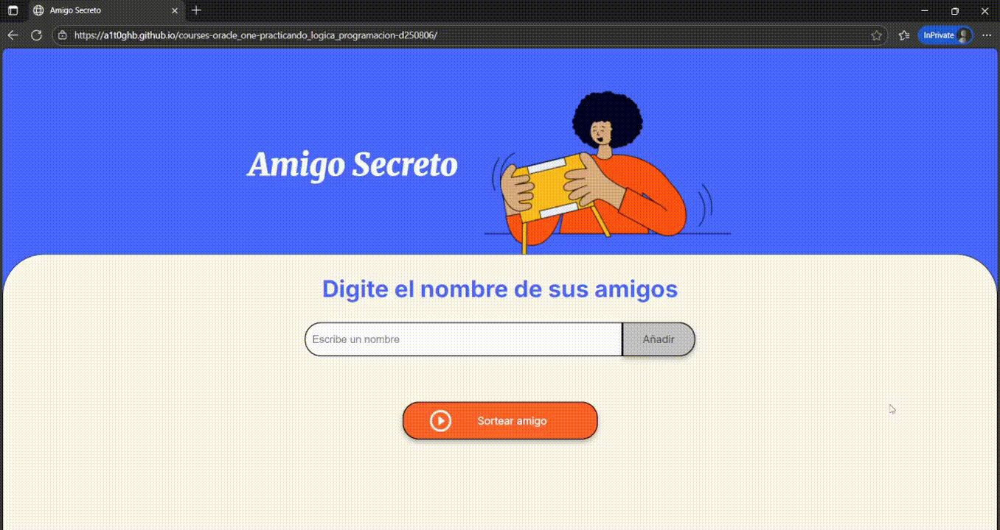

<!-- Badges:
- Source: 'https://shields.io/docs/static-badges', 'https://shields.io/badges/static-badge'.
- HTML structure followed: 'https://github.com/facebook/docusaurus/blob/main/README.md?plain=1'.
- Badges with logos: 'https://shields.io/docs/logos', 'https://simpleicons.org/', 'https://github.com/simple-icons/simple-icons/blob/master/slugs.md'.
- HTML <a> tag not redirecting: 'https://stackoverflow.com/questions/8260546/make-a-html-link-that-does-nothing-literally-nothing/8260561#8260561', 'https://www.geeksforgeeks.org/html/how-to-create-html-link-that-does-not-follow-the-link/'.
-->

<!-- Badge: WIP

  

-->

<!-- Badge: Done -->

  

<!-- README structure followed:
- 'https://www.aluracursos.com/blog/como-escribir-un-readme-increible-en-tu-github/'.
- 'https://github.com/camilafernanda/GlicoCare/'.
- 'https://github.com/nasa/openmct/'.
- 'https://github.com/facebook/docusaurus'.
-->

# Basic JavaScript Game: (en) 'Secret Santa' / (sp) 'Amigo Secreto'.

  🌐 '<a href="https://a1t0ghb.github.io/courses-oracle_one-practicando_logica_programacion-d250806/">https://a1t0ghb.github.io/courses-oracle_one-practicando_logica_programacion-d250806/</a>'

Final delivery of the 4th course: '[Practicando Lógica de Programación: Challenge Amigo secreto](https://app.aluracursos.com/course/logica-programacion-challenge-amigo-secreto/)', from module (a.k.a. 'formación' in spanish) '[Principiante en Programación G9 - ONE](https://app.aluracursos.com/formacion-programacion-primeros-pasos-grupo9-one)', of [Alura LATAM](https://www.aluracursos.com/). <b>Part of [ORACLE Next Education (ONE)](https://www.oracle.com/co/education/oracle-next-education/) education program, in LATAM</b>.

<!-- Callouts:
- Improved format taken from examples in 'https://github.com/nasa/openmct/blob/master/README.md?plain=1'.
-->
> [!NOTE]
> This README:
> - Is **mainly** written in english (en), but it might have some sections in spanish (sp), since course content is in spanish.

# About.
- The course covered topics such as:
  - Most topics covered in **previous** course 'Lógica de programación: explorar funciones y listas' repo.: '<https://github.com/a1t0ghb/courses-oracle_one-logica_programacion_II-d250726/tree/main?tab=readme-ov-file#about>'.
  - Programatic creation and manipulation of HTML objects via JavaScript; specifically unordered lists ('ul') tags and its list items ('li') tags, using DOM methods such as `.createElement()` and `.appendChild()`.
  - Use of 'for loops' to access and manipulate arrays; e.g. `for (let i = 0; i < iList.length; i++) {const friend = iList[i]; ...}`.

## 🥇 Course Certificate of Completion.
Available at '<https://app.aluracursos.com/certificate/c5b5ab0a-752e-48b0-bbb3-ab77809b67fd>'.
- Estimated workload: 10h.
- Activities: 9.
- Topics:
  1. 'Sobre los challenges'.
  2. 'Challenge Amigo secreto'.
  3. 'Entrega del Challenge'.

## Links to program resources.

**PROGRAM STRUCTURE.**
- <b>*[Course]* 'Practicando Lógica de Programación: Challenge Amigo secreto'</b>: '<https://app.aluracursos.com/course/logica-programacion-challenge-amigo-secreto/>'.
- *[Module]* 'Principiante en Programación G9 - ONE': '<https://app.aluracursos.com/formacion-programacion-primeros-pasos-grupo9-one/>'.
- **ORACLE Next Education (ONE) education program, in LATAM**: '<https://www.oracle.com/co/education/oracle-next-education/>'.
- Alura LATAM education platform: '<https://www.aluracursos.com/>'.

**COURSE RESOURCES.**
- GitHub's project repository: '<https://github.com/Oracle-Next-Education/challenge-amigo-secreto_esp/>'.
- Trello's project schedule guide: '<https://trello.com/b/v0TFbgqP/trello-challenge-amigo-secreto-esp/>'.

<!-- Embed dynamic content (image) of contributors:
- 'https://dev.to/lacolaco/introducing-contributors-img-keep-contributors-in-readme-md-gci'.
- 'https://contrib.rocks/'.
- 'https://contrib.rocks/preview?repo=a1t0ghb%2Fcourses-oracle_one-logica_programacion_II-d250726'
-->
# Contributors.

Made with [contrib.rocks](https://contrib.rocks).

<!-- Authors table structure
- From repo: 'https://github.com/camilafernanda/GlicoCare/blob/main/README.md?plain=1'.
-->
# Authors.

| [ a1t0ghb](https://github.com/a1t0ghb) |
| :---: |
